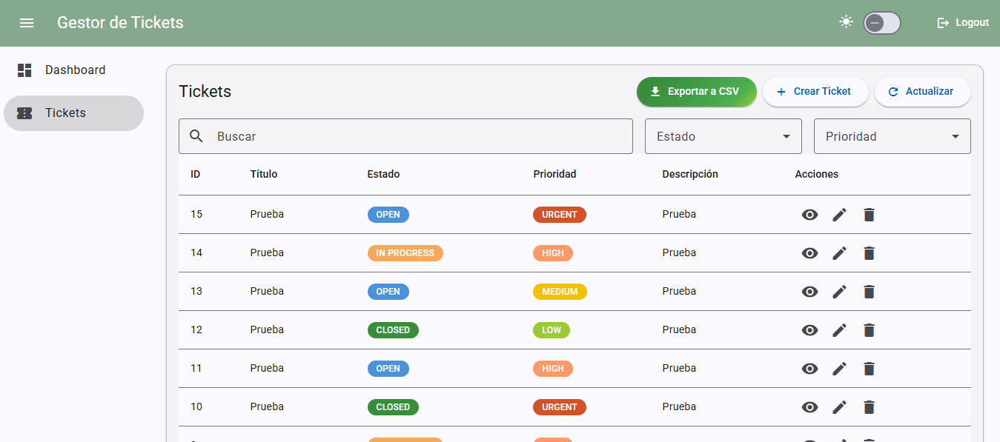
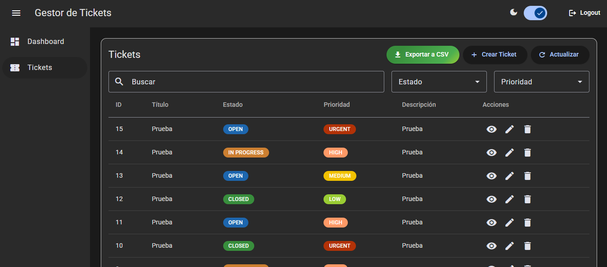
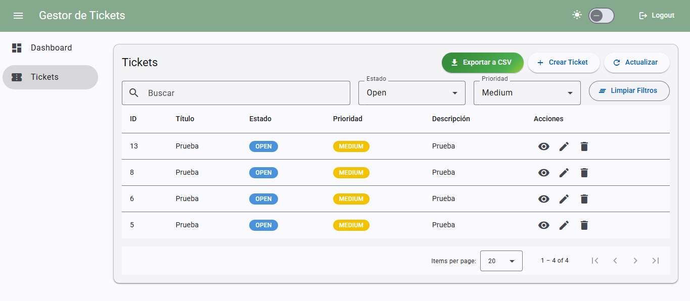
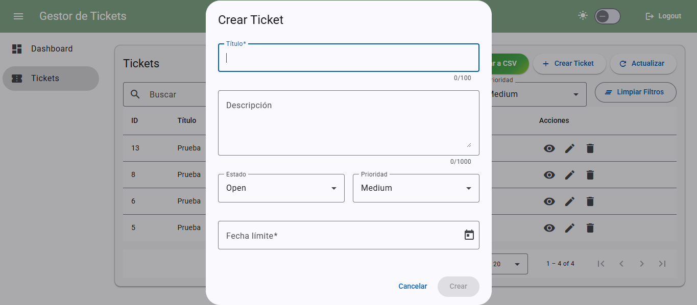
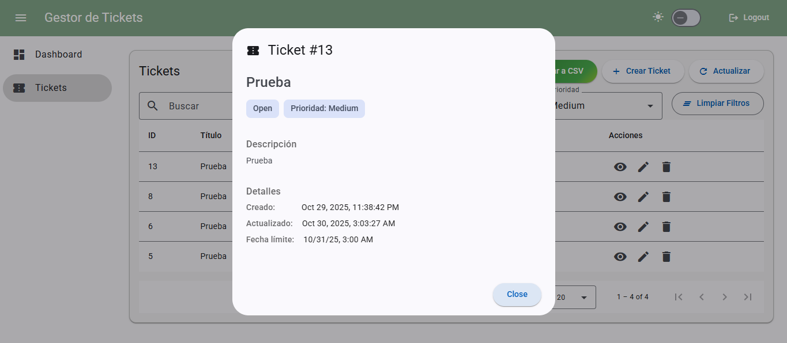
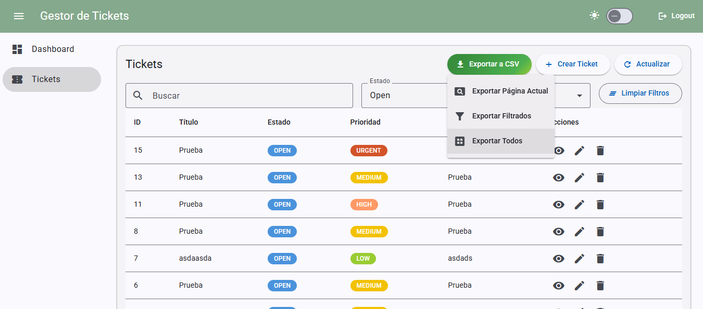
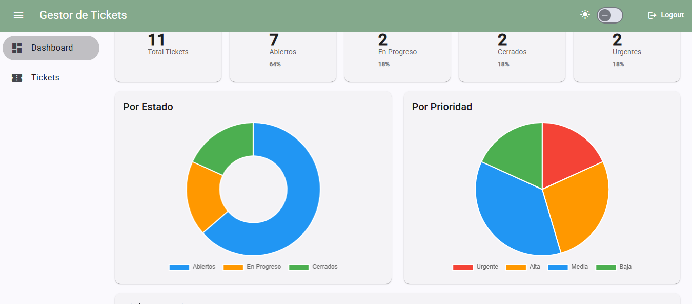

# TicketHub

<div align="center">


**Sistema profesional de gestión de tickets con arquitectura full-stack**

[Ver Screenshots](#screenshots) • [API Docs](#api-documentation) • [Instalación](#instalación)

</div>

---

## Tabla de Contenidos

- [Características](#características)
- [Tech Stack](#tech-stack)
- [Screenshots](#screenshots)
- [Instalación](#instalación)
- [Uso](#uso)
- [API Documentation](#api-documentation)
- [Roadmap](#roadmap)
- [Autor](#autor)
- [Licencia](#licencia)

---

## Características

### Frontend
- Interfaz Material Design 3 con componentes personalizados
- Dark Mode/Light Mode con persistencia en localStorage
- Visualización de datos con Chart.js
- Lazy Loading de rutas para carga bajo demanda, Bundle size inicial reducido en 38%

### Auth y Seguridad
- JWT (JSON Web Tokens) para autenticación
- HTTP Interceptor para inyección automática de tokens
- Route Guards para protección de rutas
- Gestión segura de sesiones

### Dashboard
- Métricas en tiempo real
- Gráficos: distribución por estado y prioridad
- Lista de tickets recientes para navegación rápida
- Skeleton loading states

### Gestión de Tickets
- CRUD con búsqueda en tiempo real con debounce (400ms)
- Filtros combinados por estado y prioridad
- Paginación del lado del servidor

### Exportación de Datos
- Posibilidad de exportar a CSV con tres opciones: página actual, filtrados, o todos
- CSV con formato en español

### Enterprise UX/UI 
- Diálogos de confirmación para acciones destructivas
- Validación de formularios en tiempo real
- Loading states en todas las operaciones
- Snackbars con colores según tipo (success, error, info)
- Estados vacíos con mensajes amigables
- Tooltips informativos

---

## Tech Stack

### Frontend
| Tecnología | Versión |
|-----------|---------|
| Angular | 20.0.0 |
| TypeScript | 5.8.x |
| Angular Material | 20.x |
| Chart.js | 4.x |
| ng2-charts | 8.x |
| RxJS | 7.x |
| SCSS |  |

### Backend
| Tecnología | Versión |
|-----------|---------|
| FastAPI | 0.115.x |
| Python | 3.12+ |
| SQLAlchemy | 2.0.22 |
| SQLite | 3.x |
| Pydantic | 2.x |
| python-jose | 3.x |
| passlib | 1.7.x |
| Uvicorn | |

### DevOps & Tools
- Git & GitHub
- VS Code
- Node.js 20+
- Python venv
- CORS habilitado

---

## Screenshots

### Interfaz Principal

<table>
  <tr>
    <td width="50%">
      <h4>Login</h4>
      
    </td>
    <td width="50%">
      <h4>Dashboard Tickets - Light Mode</h4>
      
    </td>
  </tr>
  <tr>
    <td width="50%">
      <h4>Dashboard Tickets - Dark Mode</h4>
      
    </td>
    <td width="50%">
      <h4>Tickets con filtros activos</h4>
      
    </td>
  </tr>
</table>

### Funcionalidades

<table>
  <tr>
    <td width="50%">
      <h4>Formulario de Ticket</h4>
      
    </td>
    <td width="50%">
      <h4>Detalles de Ticket</h4>
      
    </td>
  </tr>
  <tr>
    <td width="50%">
      <h4>Exportar a CSV</h4>
      
    </td>
    <td width="50%">
      <h4>Dashboard Estadisticas</h4>
      
    </td>
  </tr>
</table>

---

### **Flujo de Datos**

```
Acción del usuario → Componente → Servicio → HTTP Interceptor (+ JWT) 
                   → Backend API → CRUD → DB → Respuesta → Servicio 
                   → Componente → UI Update + Snackbar
```

### **Estructura de Carpetas**

```
ticket-hub/
├── .gitignore
├── LICENSE
├── README.md
├── screenshots/
├── frontend/
│   ├── src/
│   │   ├── app/
│   │   │   ├── components/
│   │   │   │   ├── dashboard/
│   │   │   │   ├── tickets-list/
│   │   │   │   ├── ticket-form/
│   │   │   │   ├── ticket-details/
│   │   │   │   ├── confirm-dialog/
│   │   │   │   ├── skeleton-loader/
│   │   │   │   └── logout-screen/
│   │   │   ├── services/
│   │   │   │   ├── auth.service.ts
│   │   │   │   ├── tickets.service.ts
│   │   │   │   ├── theme.service.ts
│   │   │   │   ├── export.service.ts
│   │   │   │   ├── auth.guard.ts
│   │   │   │   └── auth.interceptor.ts
│   │   │   ├── pipes/
│   │   │   │   └── status-label.pipe.ts
│   │   │   ├── app.ts
│   │   │   ├── app.html
│   │   │   ├── app.scss
│   │   │   └── app.routes.ts
│   │   ├── styles.scss
│   │   └── index.html
│   ├── package.json
│   └── angular.json
│
└── backend/
    ├── app/
    │   ├── routes/
    │   │   ├── auth.py
    │   │   └── tickets.py
    │   ├── core/
    │   │   ├── config.py
    │   │   └── security.py
    │   ├── crud.py
    │   ├── db.py
    │   ├── main.py
    │   ├── models.py
    │   └── schemas.py
    ├── requirements.txt
    └── dev.db
```

---

## Instalación

### **Requisitos Previos**

```bash
Node.js >= 20.x
Python >= 3.12
npm >= 10.x
```

### **1. Clonar el Repositorio**

```bash
git clone https://github.com/dcuevasi/ticket-hub.git
cd ticket-hub
```

### **2️. Setup del Backend**

```bash
cd backend

# Crear entorno virtual
python -m venv .venv

# Activar entorno virtual (Windows PowerShell)
.venv\Scripts\Activate.ps1

# O en Windows CMD
.venv\Scripts\activate.bat

# O en Linux/Mac
source .venv/bin/activate

# Instalar dependencias
pip install -r requirements.txt

# Iniciar servidor (con hot-reload)
uvicorn app.main:app --reload
```

El backend estará disponible en: `http://127.0.0.1:8000`

### **3️. Setup del Frontend**

```bash
cd frontend

# Instalar dependencias
npm install

# Iniciar servidor de desarrollo
npm start
```

El frontend estará disponible en: `http://localhost:4200`

---

## Uso

### **Credenciales de Prueba**

```
Usuario: admin
Contraseña: admin123
```

### **Workflow Básico**

1. **Login**: Ingresa con las credenciales de prueba
2. **Dashboard**: Visualiza métricas y gráficos en tiempo real
3. **Ver Tickets**: Navega a la sección "Tickets"
4. **Crear Ticket**: Click en "Crear Ticket"
5. **Filtrar**: Usa la búsqueda o filtros de estado/prioridad
6. **Exportar**: Click en "Exportar a CSV" → Elige opción
7. **Modo Oscuro**: Toggle en el toolbar superior derecho
8. **Responsive**: Reduce ventana para ver menú hamburguesa

### **Flujos Principales**

#### **Crear Ticket**
```
Tickets → Crear Ticket → Llenar formulario → Guardar
        → Snackbar verde de confirmación → Ticket aparece en lista
```

#### **Editar Ticket**
```
Tickets → Click en ícono lápiz → Modificar → Guardar
        → Confirmación → Lista actualizada
```

#### **Eliminar Ticket**
```
Tickets → Click en ícono basura → Diálogo de confirmación
        → Confirmar → Snackbar verde → Ticket eliminado
```

#### **Exportar Datos**
```
Tickets → Botón verde "Exportar a CSV" 
        → Elegir opción:
            - Página Actual (tickets visibles)
            - Filtrados (respeta filtros activos)
            - Todos (descarga completa)
        → Archivo CSV descargado
```

---

## API Documentation

FastAPI genera **documentación interactiva automática** con dos interfaces:

### **Swagger UI (Interactiva)**
```
http://127.0.0.1:8000/docs
```
Interfaz interactiva donde puedes **probar todos los endpoints** directamente desde el navegador.

### **ReDoc (Documentación Limpia)**
```
http://127.0.0.1:8000/redoc
```
Documentación más limpia y profesional, ideal para lectura.

---

### **Endpoints Principales**

#### **Autenticación**

**POST** `/auth/login`
```json
Request Body:
{
  "username": "admin",
  "password": "admin123"
}

Response:
{
  "access_token": "eyJhbGciOiJIUzI1NiIsInR5cCI6IkpXVCJ9...",
  "token_type": "bearer"
}
```

#### **Tickets**

| Método | Endpoint | Descripción |
|--------|----------|-------------|
| GET | `/tickets/` | Listar tickets (con paginación y filtros) |
| POST | `/tickets/` | Crear nuevo ticket |
| GET | `/tickets/{id}` | Obtener ticket por ID |
| PUT | `/tickets/{id}` | Actualizar ticket |
| DELETE | `/tickets/{id}` | Eliminar ticket |

**Query Parameters para GET /tickets/:**
- `page` (int, default: 1) - Número de página
- `per_page` (int, default: 20, max: 10000) - Registros por página
- `status` (string) - Filtrar por: `open`, `in_progress`, `closed`
- `priority` (string) - Filtrar por: `low`, `medium`, `high`, `urgent`
- `search` (string) - Búsqueda en título y descripción

**Todos los endpoints (excepto /auth/login) requieren:**
```
Authorization: Bearer <token>
```

> 💡 **Tip:** Para probar la API fácilmente, usa Swagger UI en `/docs` donde puedes autenticarte y hacer requests directamente.

---

## Roadmap

### **Fase 1: Core Features** (Completado)
- [x] CRUD completo de tickets
- [x] Autenticación JWT
- [x] Paginación del servidor
- [x] Validación de formularios

### **Fase 2: UX/UI Professional** (Completado)
- [x] Material Design 3
- [x] Diálogos de confirmación
- [x] Loading states
- [x] Snackbars con colores
- [x] Empty states
- [x] Glassmorphism login

### **Fase 3: Filtros y Búsqueda** (Completado)
- [x] Búsqueda en tiempo real con debounce
- [x] Filtros por estado y prioridad
- [x] Combinación de filtros
- [x] Clear filters

### **Fase 4: Dashboard** (Completado)
- [x] 5 métricas en tiempo real
- [x] Gráficos Chart.js
- [x] Tickets recientes
- [x] Diseño con gradientes

### **Fase 5: Professional Polish** (Completado)
- [x] Dark Mode con persistencia
- [x] Diseño responsive (mobile-first)
- [x] Exportar a CSV (3 opciones)
- [x] Animaciones y transiciones

### **Fase 6: Testing** (En Progreso)
- [ ] Unit tests (Jasmine/Karma)
- [ ] E2E tests (Cypress)
- [ ] Coverage > 80%

### **Fase 7: DevOps** (Planeado)
- [ ] Docker + Docker Compose
- [ ] CI/CD con GitHub Actions
- [ ] Deploy en Railway/Render
- [ ] PostgreSQL en producción


---

## Autor

**David Cuevas**

- GitHub: [@dcuevasi](https://github.com/dcuevasi)
- LinkedIn: [David Cuevas](https://www.linkedin.com/in/david-cuevas-iturrieta-ab5953264/)
- Email: dcuevasiturrieta@gmail.com

---

## Licencia

Este proyecto está bajo la Licencia MIT. Consulta el archivo [LICENSE](LICENSE) para más detalles.

---

## Agradecimientos

- [Angular Team](https://angular.io/)
- [FastAPI](https://fastapi.tiangolo.com/)
- [Material Design](https://material.angular.io/)
- [Chart.js](https://www.chartjs.org/)

---

<div align="center">

**⭐ Si este proyecto te fue útil, considera darle una estrella en GitHub ⭐**

</div>
